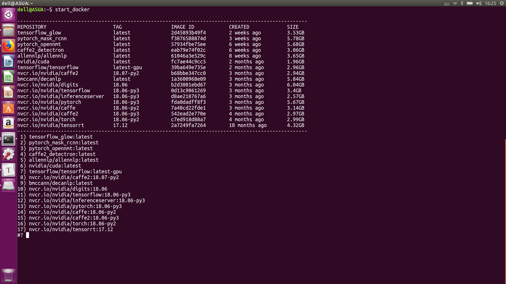

Start Docker
====

We may have many docker images. **Can we start one of them with a shortcut ?**
----

Install
----
`cp start_docker /usr/local/bin`

**PS：** 
* Please replace **nvidia-docker** with **docker** in start_docker if you do not use nivida-docker.
* Current directory is mounted on /data of docker.
* Host and container share port 8000, 8888.

Run
----
`start_docker`

License
----
StartDocker is released under the [Apache 2.0 license]

Chinese Document
----
**一键启动Docker.**

